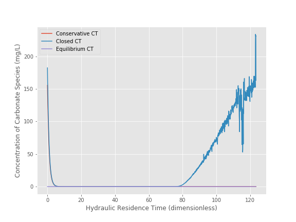

```python
from aide_design.play import*
```

#Acid Rain
###Team 8: Erica Marroquin, Jonathan Harris, Sung Min Kim
#### Data Analysis
####Data Analysis 1

1)	Plot measured pH of the lake versus hydraulic residence time (t/$\theta$).

```python
file = pd.read_csv('/Users/Erica/github/CEE4530_MINE/AcidRain_Test1.csv')
array = np.array(file)

#constants
residence_time = 15*u.min
time = array[:,1] * (u.s)
pH = array[:,3]
hydraulic_residence_time = time/residence_time

#plotting graph of ph vs hydraulic residence time
plt.figure('ax',(8,6))
plt.plot(hydraulic_residence_time,pH,'-')
plt.xlabel('Hydraulic Residence Time (dimensionless)')
plt.ylabel('pH of Lake')
plt.title('pH of Lake vs. Hydraulic Residence Time')
plt.savefig('alphagraph.png')
plt.show()

```


####Data Analysis 2
2)	Calculate alpha0, alpha1, and alpha2 based on the pH measured at each time point. Recall that each alpha represents the fraction of a particular carbonate system species at that pH. As such, the sum of the alphas at each measured pH should be 1.0!

```python
Kw = 10**(-14) * (u.mole/u.L)**2
K1_carbonate = 10**(-6.37)*u.mol/u.L
K2_carbonate = 10**(-10.25)*u.mol/u.L
K_Henry_CO2 = 10**(-1.5) * u.mole/(u.L*u.atm)
P_CO2 = 10**(-3.5) * u.atm

def invpH(pH):
  return 10**(-pH)*u.mol/u.L

def alpha0_carbonate(pH):
   alpha0_carbonate = 1/(1+(K1_carbonate/invpH(pH))*(1+(K2_carbonate/invpH(pH))))
   return alpha0_carbonate

def alpha1_carbonate(pH):
  alpha1_carbonate = 1/((invpH(pH)/K1_carbonate) + 1 + (K2_carbonate/invpH(pH)))
  return alpha1_carbonate

def alpha2_carbonate(pH):
  alpha2_carbonate = 1/(1+(invpH(pH)/K2_carbonate)*(1+(invpH(pH)/K1_carbonate)))
  return alpha2_carbonate

a_0 = alpha0_carbonate(pH)
a_1 = alpha1_carbonate(pH)
a_2 = alpha2_carbonate(pH)
```

####Data Analysis 3
3)	Assuming that the lake can be modeled as a completely mixed flow reactor and that ANC is a conservative parameter, equation 1.21 can be used to calculate the expected ANC in the lake effluent as the experiment proceeds. Graph the expected ANC in the lake effluent versus the hydraulic residence time (t/$\theta$) based on the completely mixed flow reactor equation with the plot labeled (in the legend) as “conservative ANC.”

```python
ANC_0 = (623*u.mmol) / (4*u.L)

def ANC_out(t):
  return ANC_0*2.71828**(-t)

def ANC_closed(pH,Total_Carbonates):
  return Total_Carbonates*(alpha1_carbonate(pH)+2*alpha2_carbonate(pH)) + (Kw/invpH(pH)) - invpH(pH)

def ANC_open(pH):
  denom = (P_CO2*K_Henry_CO2)/(alpha0_carbonate(pH))
  return ANC_closed(pH, denom)

#plotting expected ANC in the lake effluent vs hydraulic residence time
plt.figure('ad',(8,6))
plt.plot(hydraulic_residence_time, ANC_out(hydraulic_residence_time.magnitude),
  hydraulic_residence_time, ANC_closed(pH,ANC_0),
  hydraulic_residence_time,ANC_open(pH))
plt.xlabel('Hydraulic Residence Time (dimensionless)')
plt.ylabel('ANC Concentration (eq/L)')
plt.title('ANC Concentration of Lake vs. Hydraulic Residence Time')
plt.legend(['Closed ANC', 'Conservative ANC', 'Open ANC'], loc = 'best')
plt.savefig('/Users/Erica/github/CEE4530_MINE/ANCexpected.png')
plt.show()
```


####Data Analysis 4
4)	If we assume that there are no carbonates exchanged with the atmosphere during the experiment, then we can calculate ANC in the lake effluent by using equation 1.11 describing the ANC of a closed system. Calculate the ANC under the assumption of a closed system and plot it on the same graph produced in answering question #3 with the plot labeled (in the legend) as “closed ANC.”

```python
def ANC_closed(pH,Total_Carbonates):
  return Total_Carbonates*(alpha1_carbonate(pH)+2*alpha2_carbonate(pH)) + (Kw/invpH(pH)) - invpH(pH)
```
Plot is shown on the graph in #3.

####Data Analysis 5
5)	If we assume that there is exchange with the atmosphere and that carbonates are at equilibrium with the atmosphere, then we can calculate ANC in the lake effluent by using equation 1.15 describing the ANC of an open system. Calculate the ANC under the assumption of an open system and plot it on the same graph produced in answering question 3 with the plot labeled (in the legend) as “open ANC.”

```python
def ANC_open(pH):
  denom = (P_CO2*K_Henry_CO2)/(alpha0_carbonate(pH))
  return ANC_closed(pH, denom)
```
Plot is shown on the graph in #3.

###Data Analysis 6
6)	Derive an equation for CT (the concentration of carbonate species) as a function of time based on the input of NaHCO3 and its dilution in the completely mixed lake assuming that no carbonate species are lost or gained to the atmosphere (the equation will be the same form as equation 1.21). Graph CT versus the hydraulic residence time (t/$\theta$) with the plot labeled (in the legend) as “conservative CT.”

```python
CT_in = 0*u.g/u.L
CT_0 = (623*u.mg)/(4*u.L)

def CT_out(t):
  return CT_0*2.71828**(-t)

def closed_CT(ANC,pH):
  return (ANC + invpH(pH) - (Kw/invpH(pH))) / (alpha1_carbonate(pH) + 2*alpha2_carbonate(pH))

def equilibrium_CT(pH):
  return (P_CO2*K_Henry_CO2)/(alpha0_carbonate(pH))

plt.figure('ag',(8,6))
plt.plot(hydraulic_residence_time, CT_out(hydraulic_residence_time.magnitude),
  hydraulic_residence_time, closed_CT(ANC_out(hydraulic_residence_time.magnitude),pH),
  hydraulic_residence_time, equilibrium_CT(pH))
plt.xlabel('Hydraulic Residence Time (dimensionless)')
plt.ylabel('Concentration of Carbonate Species (mg/L)')
plt.legend(['Conservative CT', 'Closed CT', 'Equilibrium CT'], loc = 'best')
plt.savefig('/Users/Erica/github/CEE4530_MINE/ConservativeCT.png')
plt.show()
```


###Data Analysis 7
7)	Derive an equation for CT as a function of ANC and pH based on equation 1.11. Use the CMFR model to obtain ANC as a function of time (the results from question num. 3). Plot this measured CT versus hydraulic residence time (t/) on the same graph produced in answering question number 6 with the plot labeled (in the legend) as “closed CT.”

```python
def closed_CT(ANC,pH):
  return (ANC + invpH(pH) - (Kw/invpH(pH))) / (alpha1_carbonate(pH) + 2*alpha2_carbonate(pH))
```
Plot is shown on graph in #6.

###Data Analysis 8
8)	Plot the equilibrium concentration of CT (a function of pH) versus hydraulic residence time (t/) on the same graph produced in answering question 6 with the plot labeled (in the legend) as “equilibrium CT.”.

```python
def equilibrium_CT(pH):
  return (P_CO2*K_Henry_CO2)/(alpha0_carbonate(pH))
```
Plot is shown on graph in #6.

###Data Analysis 9
9)	Compare the two plots and determine whether the lake is best modeled as a volatile or non volatile system. What changes could be made to the lake to bring the lake into equilibrium with atmospheric CO2?



The lake can best be modeled as a non volatile (closed) system. Only after more than 80 residence times does the ANC concentration of the lake reach zero, where the ANC of a volatile lake is. The long period of time it takes to reach equilibrium shows that the lake could be modeled as non volatile.

To bring the lake into equilibrium with atmospheric CO2, the residence time of the lake can be shortened, so equilibrium will happen quicker.

###Data Analysis 10
10)	Analyze the data from the 2nd experiment and graph the data appropriately. What did you learn from the 2nd experiment?
```python
file_2 = pd.read_csv('/Users/Erica/github/CEE4530_MINE/Lab2Trial2.csv')
array_2 = np.array(file_2)

#constants
residence_time = 15*u.min
time_2 = array_2[:,2] * (u.s)
pH_2 = array_2[:,3]
hydraulic_residence_time_2 = time_2/residence_time

#plotting graph of ph vs hydraulic residence time
plt.figure('ax',(8,6))
plt.plot(hydraulic_residence_time_2,pH_2,'-')
plt.xlabel('Hydraulic Residence Time (dimensionless)')
plt.ylabel('pH of Lake')
plt.title('pH of Lake vs. Hydraulic Residence Time')
plt.savefig('alphagraph_2.png')
plt.show()
```

##Questions

###Question 1
1.	What do you think would happen if enough NaHCO3 were added to the lake to maintain an ANC greater than 50 µeq/L for 3 residence times with the stirrer turned off? How much NaHCO3 would need to be added?

With the stirrer turned off, the reactions would significantly slow down and the effect would cause the ANC to decrease slower. The same amount of NaHCO3 (6750 mg) would be added to maintain an ANC greater than 50 ueq/L since the end ANC would be higher than with the stirrer.

###Question 2
2. What are some of the complicating factors you might find in attempting to remediate a lake using CaCO3? Below is a list of issues to consider.
* extent of mixing
* solubility of CaCO3 (find the solubility and compare with NaHCO3)
* density of CaCO3 slurry (find the density of CaCO3)

|                 | NaHCO3              | CaCO3|
|:--------        |:--------:           |----:|
| Solubility      | 100 g/L             |     15 mg/L        |
| Density         | 2.1g/cm<sup>3       | 2.8g/cm<sup>3      |

A key factor in the reaction rate is the extent of mixing. Without constant mixing, reactions are slowed down and the ANC does not change quickly. Comparing solubility and density values, NaHCO3 is much more soluble and less dense than CaCO3. Remediating a lake using CaCO3 will be less efficient compared to using NaHCO3. Remediation to a lake is used to mitigate the deleterious effects of acid rain; with CaCO3's solubility, the carbonate will not dissociate fast enough to increase the ANC. That would be potentially dangerous since ANC would be decreasing faster than it being restored.
